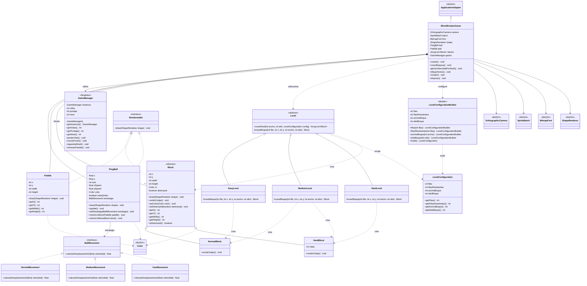

# GM-3 - Diagrama UML General BlockBreaker

```mermaid
classDiagram
direction TB

class ApplicationAdapter {
    <<libGDX>>
}

class ShapeRenderer {
    <<libGDX>>
}

class OrthographicCamera {
    <<libGDX>>
}

class SpriteBatch {
    <<libGDX>>
}

class BitmapFont {
    <<libGDX>>
}

class Color {
    <<libGDX>>
}

class BlockBreakerGame {
    -OrthographicCamera camera
    -SpriteBatch batch
    -BitmapFont font
    -ShapeRenderer shape
    -PingBall ball
    -Paddle pad
    -ArrayList~Block~ blocks
    -GameManager gestor
    +create() void
    +crearBloques() void
    -aplicarVelocidadPorNivel() void
    +dibujaTextos() void
    +render() void
    +dispose() void
}

class Renderizable {
    <<interface>>
    +draw(ShapeRenderer shape) void
}

class Block {
    <<abstract>>
    -int x
    -int y
    -int width
    -int height
    -Color cc
    -boolean destroyed
    +draw(ShapeRenderer shape) void
    +recibirGolpe() void
    +setColor(Color color) void
    +setDestroyed(boolean destroyed) void
    +getX() int
    +getY() int
    +getWidth() int
    +getHeight() int
    +isDestroyed() boolean
}

class NormalBlock {
    +recibirGolpe() void
}

class HardBlock {
    -int vidas
    +recibirGolpe() void
}

class Paddle {
    -int x
    -int y
    -int width
    -int height
    +draw(ShapeRenderer shape) void
    +getX() int
    +getY() int
    +getWidth() int
    +getHeight() int
}

class PingBall {
    -float x
    -float y
    -int size
    -float xSpeed
    -float ySpeed
    -Color color
    -boolean estaQuieto
    -BallMovement estrategia
    +draw(ShapeRenderer shape) void
    +update() void
    +setEstrategia(BallMovement estrategia) void
    +checkCollision(Paddle paddle) void
    +checkCollision(Block block) void
}

class BallMovement {
    <<interface>>
    +calcularDesplazamiento(float velocidad) float
}

class NormalMovement {
    +calcularDesplazamiento(float velocidad) float
}

class MediumMovement {
    +calcularDesplazamiento(float velocidad) float
}

class FastMovement {
    +calcularDesplazamiento(float velocidad) float
}

class GameManager {
    <<Singleton>>
    -GameManager instancia
    -int vidas
    -int puntaje
    -int nivel
    -GameManager()
    +getInstancia() GameManager
    +getVidas() int
    +getPuntaje() int
    +getNivel() int
    +perderVida() void
    +sumarPunto() void
    +siguienteNivel() void
    +reiniciarPartida() void
}

class Level {
    <<abstract>>
    +crearNivel(int ancho, int alto, LevelConfiguration config) ArrayList~Block~
    #crearBloque(int fila, int x, int y, int ancho, int alto) Block
}

class EasyLevel {
    #crearBloque(int fila, int x, int y, int ancho, int alto) Block
}

class MediumLevel {
    #crearBloque(int fila, int x, int y, int ancho, int alto) Block
}

class HardLevel {
    #crearBloque(int fila, int x, int y, int ancho, int alto) Block
}

class LevelConfiguration {
    -int filas
    -int filasResistentes
    -int anchoBloque
    -int altoBloque
    +getFilas() int
    +getFilasResistentes() int
    +getAnchoBloque() int
    +getAltoBloque() int
}

class LevelConfigurationBuilder {
    <<Builder>>
    -int filas
    -int filasResistentes
    -int anchoBloque
    -int altoBloque
    +filas(int filas) LevelConfigurationBuilder
    +filasResistentes(int filas) LevelConfigurationBuilder
    +anchoBloque(int ancho) LevelConfigurationBuilder
    +altoBloque(int alto) LevelConfigurationBuilder
    +build() LevelConfiguration
}

ApplicationAdapter <|-- BlockBreakerGame

Renderizable <|.. Block
Renderizable <|.. Paddle
Renderizable <|.. PingBall

Block <|-- NormalBlock
Block <|-- HardBlock

BallMovement <|.. NormalMovement
BallMovement <|.. MediumMovement
BallMovement <|.. FastMovement

Level <|-- EasyLevel
Level <|-- MediumLevel
Level <|-- HardLevel

PingBall --> BallMovement : estrategia

BlockBreakerGame *-- PingBall
BlockBreakerGame *-- Paddle
BlockBreakerGame o-- "0..*" Block : blocks
BlockBreakerGame --> GameManager : utiliza
BlockBreakerGame ..> Level : selecciona
BlockBreakerGame ..> LevelConfigurationBuilder : configura

Level ..> LevelConfiguration : recibe
Level ..> Block : crea

LevelConfigurationBuilder ..> LevelConfiguration : build

EasyLevel ..> NormalBlock : crea
MediumLevel ..> NormalBlock : crea
MediumLevel ..> HardBlock : crea
HardLevel ..> HardBlock : crea

BlockBreakerGame --> OrthographicCamera
BlockBreakerGame --> SpriteBatch
BlockBreakerGame --> BitmapFont
BlockBreakerGame --> ShapeRenderer

Block ..> Color
PingBall ..> Color
Paddle ..> Color
```
