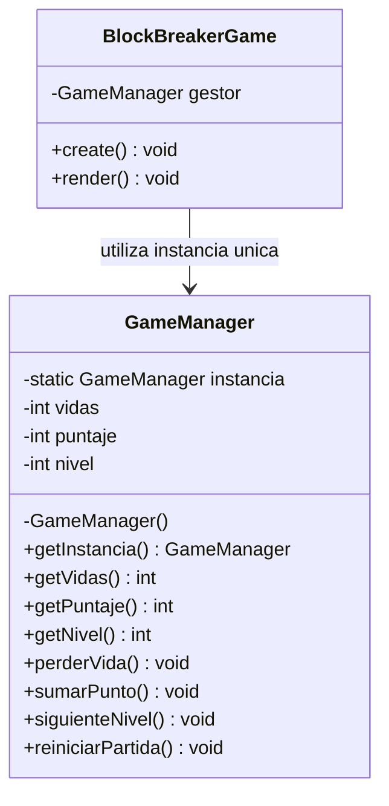
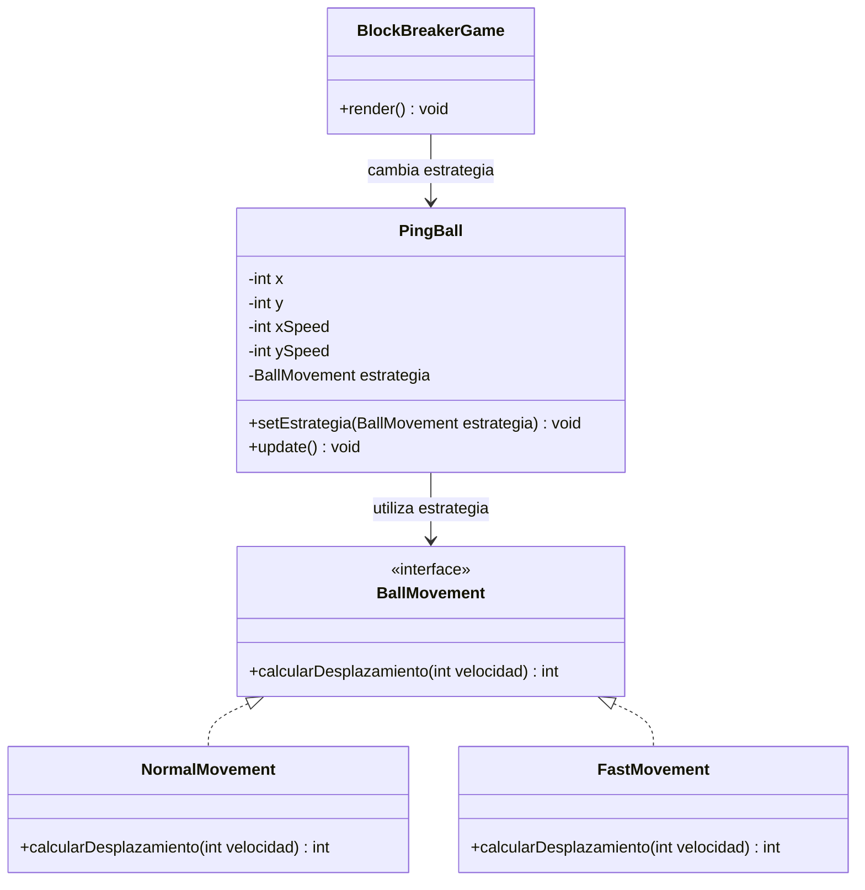
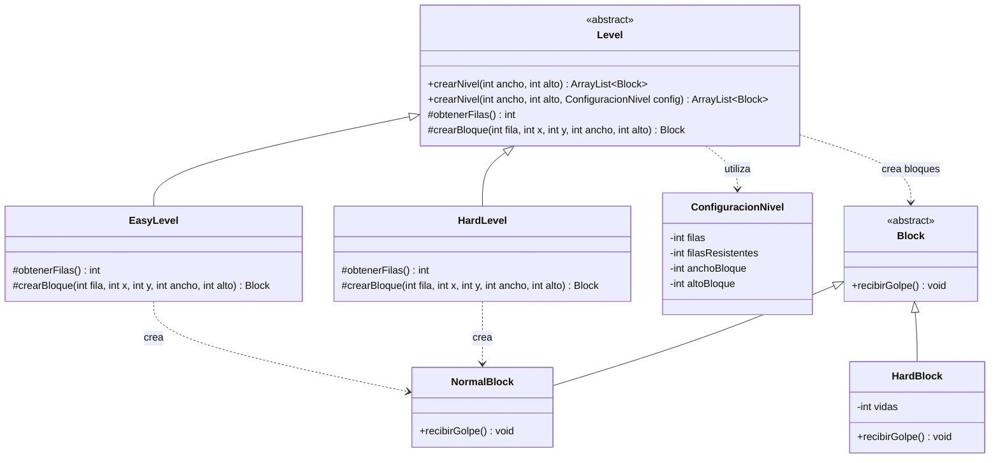
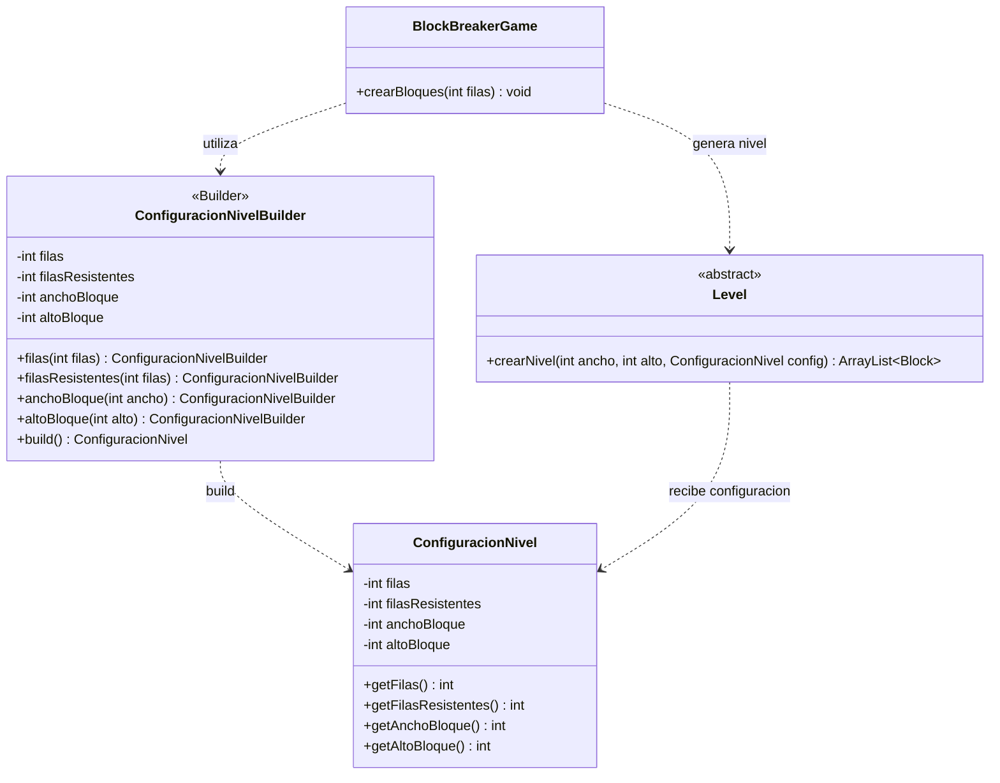

## Singleton

```mermaid
classDiagram
    class GameManager {
        -static GameManager instancia
        -int vidas
        -int puntaje
        -int nivel
        -GameManager()
        +getInstancia() GameManager
        +getVidas() int
        +getPuntaje() int
        +getNivel() int
        +perderVida() void
        +sumarPunto() void
        +siguienteNivel() void
        +reiniciarPartida() void
    }

    class BlockBreakerGame {
        -GameManager gestor
        +create() void
        +render() void
    }

    BlockBreakerGame --> GameManager : utiliza instancia unica
```

## Strategy

```mermaid
classDiagram
    class BallMovement {
        <<interface>>
        +calcularDesplazamiento(int velocidad) int
    }

    class NormalMovement {
        +calcularDesplazamiento(int velocidad) int
    }

    class FastMovement {
        +calcularDesplazamiento(int velocidad) int
    }

    class PingBall {
        -int x
        -int y
        -int xSpeed
        -int ySpeed
        -BallMovement estrategia
        +setEstrategia(BallMovement estrategia) void
        +update() void
    }

    class BlockBreakerGame {
        +render() void
    }

    BallMovement <|.. NormalMovement
    BallMovement <|.. FastMovement

    PingBall --> BallMovement : utiliza estrategia
    BlockBreakerGame --> PingBall : cambia estrategia
```

## Template Method

```mermaid
classDiagram
    class Level {
        <<abstract>>
        +crearNivel(int ancho, int alto) ArrayList~Block~
        +crearNivel(int ancho, int alto, ConfiguracionNivel config) ArrayList~Block~
        #obtenerFilas() int
        #crearBloque(int fila, int x, int y, int ancho, int alto) Block
    }

    class EasyLevel {
        #obtenerFilas() int
        #crearBloque(int fila, int x, int y, int ancho, int alto) Block
    }

    class HardLevel {
        #obtenerFilas() int
        #crearBloque(int fila, int x, int y, int ancho, int alto) Block
    }

    class Block {
        <<abstract>>
        +recibirGolpe() void
    }

    class NormalBlock {
        +recibirGolpe() void
    }

    class HardBlock {
        -int vidas
        +recibirGolpe() void
    }

    class ConfiguracionNivel {
        -int filas
        -int filasResistentes
        -int anchoBloque
        -int altoBloque
    }

    Level <|-- EasyLevel
    Level <|-- HardLevel

    Block <|-- NormalBlock
    Block <|-- HardBlock

    Level ..> ConfiguracionNivel : utiliza
    Level ..> Block : crea bloques
    EasyLevel ..> NormalBlock : crea
    HardLevel ..> NormalBlock : crea
```

## Builder

```mermaid
classDiagram
    class ConfiguracionNivelBuilder {
        <<Builder>>
        -int filas
        -int filasResistentes
        -int anchoBloque
        -int altoBloque
        +filas(int filas) ConfiguracionNivelBuilder
        +filasResistentes(int filas) ConfiguracionNivelBuilder
        +anchoBloque(int ancho) ConfiguracionNivelBuilder
        +altoBloque(int alto) ConfiguracionNivelBuilder
        +build() ConfiguracionNivel
    }

    class ConfiguracionNivel {
        -int filas
        -int filasResistentes
        -int anchoBloque
        -int altoBloque
        +getFilas() int
        +getFilasResistentes() int
        +getAnchoBloque() int
        +getAltoBloque() int
    }

    class BlockBreakerGame {
        +crearBloques(int filas) void
    }

    class Level {
        <<abstract>>
        +crearNivel(int ancho, int alto, ConfiguracionNivel config) ArrayList~Block~
    }

    ConfiguracionNivelBuilder ..> ConfiguracionNivel : build
    BlockBreakerGame ..> ConfiguracionNivelBuilder : utiliza
    BlockBreakerGame ..> Level : genera nivel
    Level ..> ConfiguracionNivel : recibe configuracion
```
